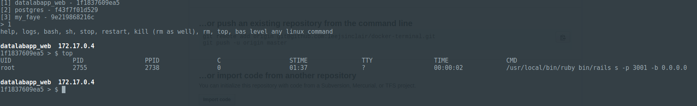

# docker-terminal


# Starting

Make sure the script is executable.

```
chmod +x ./terminal.sh 
```

Add it to an executable path e.g.

```
sudo mv ./terminal.sh /usr/bin/dotm
```

Start using docker console:

```
dotm
```

This will display a list of containers that have the status '**UP**'. To the left of each container ID will be displayed a number e.g.

```
Active containers:
[1]    42a898de5d40    postgres
Number > _
```

At this time type 'help' to display a list of available commands:

```
up	-	docker-compose up
down	-	docker-compose down
lcd	-	change local current directory
```

Alternatively type the number of the container to work with; in the example above type '1'.

# Container selected

When a container is selected type 'help' to see a list of available commands:

```
help	-	Help screen
logs	-	Logs of docker instance
bash	-	Execute bash script into container
sh	-	Execute sh into container
stop	-	Stop container
reset	-	Reset container
kill	-	Kill container (rm as well)
rm	-	Remove container
top	-	Docker top
CMD	-	Type any linux command and have it executed within the container
```

Typing any of these commands (except 'exit') will be executed against the currently selected container.
